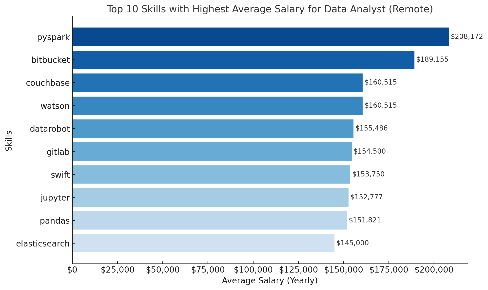

# Introduction
This project explores various SQL queries to analyze data analyst job postings, focusing on high-paying opportunities, in-demand skills, and optimal skill sets for these roles. The analysis provides insights into which roles and skills command higher salaries and which are more frequently demanded in remote data analyst positions.

Check the SQL queries here: [project_sql folder](/project_sql/)


# Background
As an FP&A analyst with 8 years of experience, I have recently started developing my data analysis skills, focusing on expanding my proficiency in SQL. While practicing SQL, I became curious about the job market for data analyst positions, particularly remote roles, as I plan to travel. 

### Here are the questions I wanted to answer through my queries

1. Which remote data analyst roles offer the highest salaries?

2. What are the highest-paying skills for data analysts?

3. Which skills are most in-demand for data analyst positions?

4. What are the specific skills linked to the highest-paying data analyst roles?

5. What is the optimal combination of skills for remote data analysts?


# Tools I Used
- **SQL**: All the analysis was performed using SQL to query a dataset of job postings.
- **VS Code**: Used for coding and testing the SQL queries.
- **PostgreSQL**: The database engine where the data was hosted and queried.
- **GitHub**: Used for version control and hosting this project, including the SQL queries and results.


# The Analysis
The analysis was performed in five steps:

### 1. Top Paying Data Analyst Jobs
   - A query was used to identify the top 10 highest-paying data analyst jobs. The results were filtered to only include remote jobs and sorted by the average yearly salary.

   ``` sql
   SELECT
    job_id,
    job_title,
    job_location,
    job_schedule_type,
    salary_year_avg,
    job_posted_date,
    name AS company_name
FROM
    job_postings_fact
LEFT JOIN company_dim ON job_postings_fact.company_id = company_dim.company_id
WHERE
    job_title_short = 'Data Analyst' AND
    job_location = 'Anywhere' AND
    salary_year_avg IS NOT NULL
ORDER BY
    salary_year_avg DESC
LIMIT 10
```
Here’s a more general breakdown of the top-paying data analyst jobs:

- **Wide Salary Range**: Salaries for remote data analyst roles vary significantly, ranging from **$184,000** to **$650,000** annually, highlighting a broad spectrum of compensation in the field.
- **Diverse Employers**: The job listings come from a variety of companies, from large tech firms like **Meta** to healthcare and financial organizations like **Uclahealthcareers** and **SmartAsset**.
- **Variety of Job Titles**: The roles include a wide array of positions, such as **Data Analyst**, **Director of Analytics**, and **Principal Data Analyst**, reflecting different levels of responsibility and specialization within the field.


*Bar graph visualizing the salary for the top 10 salaries for remote data analyst positions*

### 2. Top Paying Job Skills: 
   - A query explored the highest-paying skills in data analyst roles, highlighting which technical skills command the highest salaries across various job postings.

   ``` sql
   WITH top_paying_jobs AS (
    SELECT
        job_id,
        job_title,
        salary_year_avg,
        name AS company_name
    FROM
        job_postings_fact
    LEFT JOIN company_dim ON job_postings_fact.company_id = company_dim.company_id
    WHERE
        job_title_short = 'Data Analyst' AND
        job_location = 'Anywhere' AND
        salary_year_avg IS NOT NULL
    ORDER BY
        salary_year_avg DESC
    LIMIT 10
)

SELECT 
    top_paying_jobs.*,
    skills
FROM top_paying_jobs
INNER JOIN skills_job_dim ON top_paying_jobs.job_id = skills_job_dim.job_id
INNER JOIN skills_dim ON skills_job_dim.skill_id = skills_dim.skill_id
ORDER BY 
    salary_year_avg DESC
```

Here are the insights from the skills column of the top 10 data analyst roles:

- **SQL** appears 8 times, making it the most frequently mentioned skill.
- **Python** is mentioned 7 times, indicating its importance for data analysis.
- **Tableau** comes next with 6 mentions, emphasizing the need for data visualization skills.


*Bar graph visualizing the most demanded skills for the top 10 highest paying Data Analyst remote offers*

### 3. Most Demanded Skills
   - This analysis focused on the frequency of certain skills in job postings, identifying which skills are the most sought after by employers in the data analyst field.

   ``` sql
   SELECT
    skills,
    COUNT(skills_job_dim.job_id) AS demand_count
FROM job_postings_fact
INNER JOIN skills_job_dim ON job_postings_fact.job_id = skills_job_dim.job_id
INNER JOIN skills_dim ON skills_job_dim.skill_id = skills_dim.skill_id
WHERE   
    job_title_short = 'Data Analyst'
GROUP BY
    skills
ORDER BY 
    demand_count DESC
LIMIT 5
```
Here's the breakdown of the top demanded skills for Data Analyst roles:

- **Core Data Skills (SQL, Excel, Python)**: SQL leads, with Excel and Python following closely, highlighting their essential roles in data querying, manipulation, and advanced analytics.
- **Visualization & BI Tools (Tableau, Power BI)**: Strong demand for Tableau and Power BI emphasizes the importance of data visualization and business intelligence in modern analytics.

| Skill     | Demand Count |
|-----------|---------------|
| SQL       | 7,291         |
| Excel     | 4,611         |
| Python    | 4,330         |
| Tableau   | 3,745         |
| Power BI  | 2,609         |

*Skill demand for Data Analyst remote jobs*

### 4. Top Paying Skills
   - This query combined salary data with skills to reveal which specific skills are associated with the highest-paying data analyst positions.

   ``` sql
SELECT
    skills,
    ROUND(AVG(salary_year_avg), 0) AS avg_salary
FROM job_postings_fact
INNER JOIN skills_job_dim ON job_postings_fact.job_id = skills_job_dim.job_id
INNER JOIN skills_dim ON skills_job_dim.skill_id = skills_dim.skill_id
WHERE   
    job_title_short = 'Data Analyst'
    AND salary_year_avg IS NOT NULL
    AND job_work_from_home = True
GROUP BY
    skills
ORDER BY 
    avg_salary DESC
LIMIT 25;
   ```

Here are three key trends from the top-paying skills for remote data analyst roles in 2023:

- **Big Data & Machine Learning**: Expertise in tools like PySpark ($208K), 
DataRobot ($155K), and Databricks ($141K) is highly valued, reflecting the focus on big data and AI.

- **DevOps & Cloud Expertise**: High demand for cloud infrastructure 
and CI/CD skills is evident with tools like Bitbucket ($189K), GitLab ($154K), and GCP ($122K).

- **Programming & BI Tools**: Strong proficiency in Python libraries (Pandas, Numpy) 
and business intelligence tools like MicroStrategy and PostgreSQL leads to top salaries. 




### 5. Optimal Skills for Data Analysts
   - Finally, a query was designed to determine the optimal set of skills for remote data analysts, combining both demand and salary data.

```sql
SELECT
    skills_dim.skill_id,
    skills_dim.skills,
    COUNT(skills_job_dim.job_id) AS demand_count,
    ROUND(AVG(salary_year_avg), 0) AS avg_salary
FROM job_postings_fact
INNER JOIN skills_job_dim ON job_postings_fact.job_id = skills_job_dim.job_id
INNER JOIN skills_dim ON skills_job_dim.skill_id = skills_dim.skill_id
WHERE
    job_title_short = 'Data Analyst'
    AND salary_year_avg IS NOT NULL
    AND job_work_from_home = True
GROUP BY
    skills_dim.skill_id
HAVING
    COUNT(skills_job_dim.job_id) >10
ORDER BY
    avg_salary DESC,
    demand_count DESC
LIMIT 25;
```

**Key Takeaways**
- **Go** stands out as a high-paying skill, suggesting its growing relevance in data roles that require efficient, scalable solutions.
- Cloud computing expertise, especially in **Snowflake**, **Azure**, and **AWS**, is crucial for well-paid data analysts, reflecting the industry's shift towards cloud-based infrastructure.
- **Hadoop** continues to be in demand, proving its value in handling large-scale data despite newer technologies.

| Skills     | Demand Count | Average Salary |
|------------|--------------|----------------|
| Go         | 27           | $115,320       |
| Confluence | 11           | $114,210       |
| Hadoop     | 22           | $113,193       |
| Snowflake  | 37           | $112,948       |
| Azure      | 34           | $111,225       |
| BigQuery   | 13           | $109,654       |
| AWS        | 32           | $108,317       |
| Java       | 17           | $106,906       |
| SSIS       | 12           | $106,683       |
| Jira       | 20           | $104,918       |


# What I Learned
- **SQL Proficiency**: I improved my ability to write complex SQL queries involving joins, filters, and sorting to extract meaningful insights from large datasets.
- **Job Market Trends**: I gained insights into which skills are most valued in the job market and which combinations of skills can lead to higher salaries.
- **Data Analysis**: Understanding how to leverage SQL to analyze real-world data provided me with valuable knowledge about data manipulation and trend identification.

# Conclusion

- **High Salary Potential**: Remote data analyst roles offer a wide range of salaries, up to $650K annually, with companies across various industries, including tech, healthcare, and finance.
  
- **Key Skills for Top-Paying Roles**: 
  - **SQL** and **Python** remain the most in-demand skills, with visualization tools like **Tableau** and **Power BI** following closely.
  - Expertise in **Big Data**, **Machine Learning** tools (e.g., PySpark, Databricks), and **DevOps** (Bitbucket, GitLab) is associated with higher salaries.

- **Skills with Growing Relevance**:
  - **Go**, **Snowflake**, and **Cloud Computing** (Azure, AWS) stand out as highly paid skills, reflecting the growing importance of cloud infrastructure in data analysis.
  - Despite new technologies, **Hadoop** remains a valuable skill for handling large-scale data.

- **Optimal Skill Set**: For remote data analysts looking to maximize both demand and salary, focusing on a combination of core data analysis skills (SQL, Python), cloud infrastructure (Azure, AWS), and advanced tools (Snowflake, BigQuery) offers a strong competitive advantage in the market.
